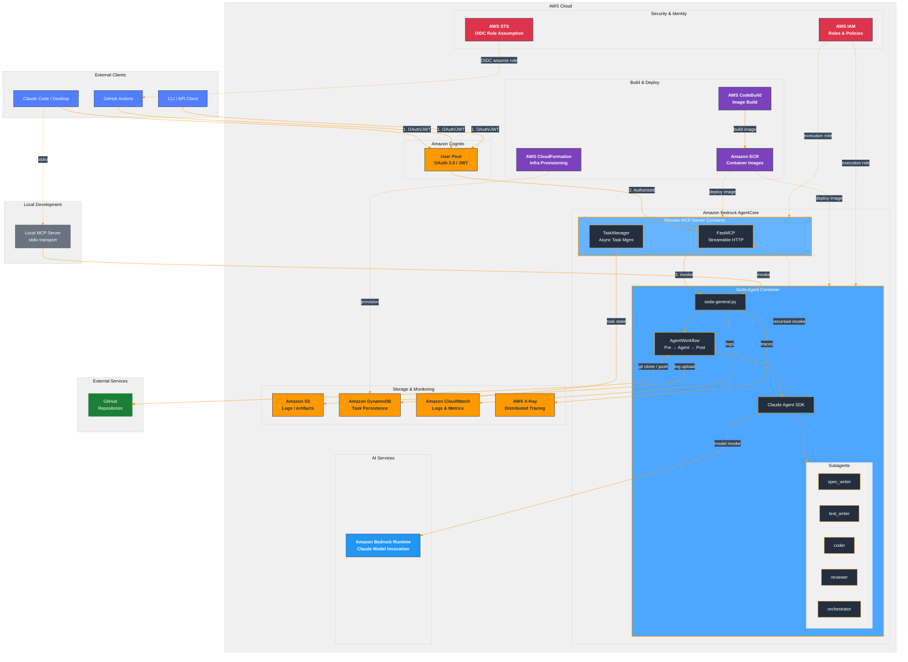

# Soda初心者向けガイド

このドキュメントは、AIエージェントの仕組みを知らない方でも理解できるように、Sodaの概要・導入方法を説明します。

---

## 目次

1. [AIエージェントとは？](#1-aiエージェントとは)
2. [Sodaとは？](#2-sodaとは)
3. [なぜSodaが必要なのか？](#3-なぜsodaが必要なのか)
4. [Sodaでできること](#4-sodaでできること)
5. [Sodaの仕組み](#5-sodaの仕組み)
6. [前提知識](#6-前提知識)
7. [クイックスタート（5ステップ）](#7-クイックスタート5ステップ)
8. [環境構築の注意点](#8-環境構築の注意点)
9. [ドキュメント体系](#9-ドキュメント体系)
10. [よくある質問（FAQ）](#10-よくある質問faq)
11. [トラブルシューティング](#11-トラブルシューティング)
12. [導入チェックリスト](#12-導入チェックリスト)
13. [付録: 用語集](#13-付録-用語集)
14. [変更履歴](#14-変更履歴)

---

## 1. AIエージェントとは？

**AIエージェント**とは、人間の指示に基づいて**自律的にタスクを実行する**AIプログラムのことです。

### 従来のAIチャットとの違い

| 項目 | 従来のAIチャット | AIエージェント |
|------|----------------|---------------|
| できること | 質問に答える | 質問に答える＋**実際に作業する** |
| ファイル操作 | できない | **ファイルの読み書き・編集ができる** |
| コマンド実行 | できない | **ターミナルコマンドを実行できる** |
| 複数ステップ | 1回のやり取り | **複数ステップを自律的に進める** |

### イメージ

```
従来のAIチャット:
  あなた: 「ログイン機能のコードを教えて」
  AI:     「以下のコードをコピーして使ってください...」
  あなた: （手動でコピーして、ファイルに貼り付けて、テストして...）

AIエージェント:
  あなた: 「ログイン機能を作って」
  AI:     「認証システムを実装しますね。」
          （ファイルを作成し、コードを書き、テストを実行し、コミットまでしてくれる）
```

---

## 2. Sodaとは？

**Soda** (Software Developer Agents) は、AIエージェントを**チームのように使える**仕組みです。

### 一言で言うと

> **「プロンプト1つで、仕様作成・テスト・実装・レビューまで自動化するAI開発チーム」**

### Sodaの特徴

```
┌─────────────────────────────────────────┐
│  あなた                                  │
│  「認証機能を実装して」                    │
└─────────────┬───────────────────────────┘
              │ プロンプト
              ↓
┌─────────────────────────────────────────┐
│  Soda (AWS Bedrock AgentCore上で動作)    │
│                                         │
│  ┌──────────┐  ┌──────────┐             │
│  │spec_writer│→│test_writer│             │
│  │ 仕様作成  │  │テスト作成 │             │
│  └──────────┘  └──────────┘             │
│       ↓              ↓                  │
│  ┌──────────┐  ┌──────────┐             │
│  │  coder   │→│ reviewer  │             │
│  │  実装    │  │ レビュー  │             │
│  └──────────┘  └──────────┘             │
└─────────────┬───────────────────────────┘
              │ 自動コミット・プッシュ
              ↓
┌─────────────────────────────────────────┐
│  GitHub                                  │
│  （実装済みコード＋テスト＋ドキュメント）    │
└─────────────────────────────────────────┘
```

- **AWS Bedrock AgentCore** というクラウド基盤で動作するため、ローカルPCのスペックに依存しません
- **サブエージェント** という専門家チームが、それぞれの役割で品質を担保します
- **Git統合** により、成果物は自動的にリポジトリに反映されます

### 公式リポジトリ

- https://github.com/IoVPF-AgenticSoftwareEngineering/soda

---

## 3. なぜSodaが必要なのか？

### Sodaがない場合の問題

| 問題 | 詳細 |
|------|------|
| 手作業が多い | 仕様作成→テスト→実装→レビューを全て人手で進める |
| AIの活用が個人依存 | 各開発者がバラバラにAIチャットを使い、品質にばらつきが出る |
| ワークフローが断絶 | AIの回答をコピペしてファイルに貼り付け、手動でテスト実行 |
| 環境に依存 | 開発者のPCスペックやツール設定に依存する |

### Sodaがある場合の解決

| 解決 | 詳細 |
|------|------|
| ワークフロー自動化 | プロンプト1つで仕様→テスト→実装→レビューが一気通貫 |
| 品質の標準化 | サブエージェントがTDD（テスト駆動開発）の規律を維持 |
| シームレスなGit連携 | コード変更が自動でコミット・プッシュされる |
| クラウドネイティブ | AWS上で動作し、ローカル環境に依存しない |

---

## 4. Sodaでできること

### ユースケース

| ユースケース | 説明 | 使用するサブエージェント |
|---|---|---|
| **TDD開発の自動化** | 仕様作成→テスト作成→実装→レビューを自動で実行 | spec_writer → test_writer → coder → reviewer |
| **コードレビューの自動化** | プルリクエストのコードを自動レビュー | reviewer |
| **ドキュメント生成** | コードベースからドキュメントを自動生成 | doc_writer |
| **アーキテクチャ設計** | 要件に基づくアーキテクチャ設計の支援 | architect |
| **汎用コーディング** | バグ修正、機能追加、リファクタリング等 | general_coding_agent |

### 実行例

```bash
# 基本的な呼び出し
$ agentcore invoke '{"prompt": "List all files", "repo_url": "https://github.com/owner/repo.git"}'

# サブエージェントを指定して実行
$ agentcore invoke '{
  "prompt": "認証モジュールのバグを修正してください",
  "repo_url": "https://github.com/owner/repo.git",
  "subagent": "coder",
  "auto_commit": true,
  "auto_push": true
}'
```

**実行結果のイメージ:**

```
Cloning repository... done
Starting coder subagent...
  - Analyzing src/auth/login.py
  - Found issue: token expiration not handled
  - Writing fix...
  - Running tests... 11/11 passed
  - Committing changes... done
  - Pushing to origin/feature/fix-auth... done

Result: Bug fixed and pushed to feature/fix-auth
```

### 主な機能

| 機能 | 説明 |
|------|------|
| **Git統合** | リポジトリのクローン、ブランチ管理、自動コミット・プッシュ |
| **ローカルMCP** | 同一マシンからの呼び出し（stdio通信） |
| **リモートMCP** | ネットワーク経由での呼び出し（Cognito認証付き） |
| **サブエージェント** | 役割ごとに特化したエージェントが処理を分担 |
| **プラグイン** | GitHubリポジトリから拡張機能を自動フェッチ |

---

## 5. Sodaの仕組み

### 基本データフロー

```mermaid
flowchart LR
    User["ユーザー"]
    CC["Claude Code"]
    MCP["MCP サーバー"]
    Soda["Soda エージェント<br/>(AgentCore)"]
    Sub["サブエージェント<br/>coder / reviewer / ..."]
    Git["GitHub"]

    User -->|"プロンプト"| CC
    CC -->|"invoke_soda"| MCP
    MCP -->|"agentcore invoke"| Soda
    Soda --> Sub
    Sub -->|"git push"| Git

    style User fill:#527FFF,stroke:#232F3E,color:#ffffff
    style CC fill:#527FFF,stroke:#232F3E,color:#ffffff
    style MCP fill:#6B7280,stroke:#374151,color:#ffffff
    style Soda fill:#232F3E,stroke:#FF9900,color:#ffffff
    style Sub fill:#232F3E,stroke:#FF9900,color:#ffffff
    style Git fill:#1a7f37,stroke:#1a7f37,color:#ffffff
```



**フロー:**

1. ユーザーが Claude Code にプロンプトを入力
2. Claude Code が MCP サーバー経由で `invoke_soda` を呼び出し
3. Soda エージェントが AgentCore 上で起動
4. タスクに応じたサブエージェント（coder, reviewer 等）が処理を実行
5. 結果を Git リポジトリに反映（自動コミット・プッシュ）

### サブエージェントの種類

| サブエージェント | 役割 | 出力先 |
|-----------------|------|--------|
| `spec_writer` | 要件・仕様作成 | docs/ |
| `test_writer` | テスト作成 (TDD Red) | tests/ |
| `coder` | 実装 (TDD Green) | src/ |
| `reviewer` | コードレビュー | (読み取り専用) |
| `doc_writer` | ドキュメント作成 | docs/ |
| `architect` | アーキテクチャ設計 | docs/ |
| `orchestrator` | ワークフロー調整 | - |
| `general_coding_agent` | 汎用コーディング | 制限なし |

### 呼び出し方法の比較

```
【方法1: CLIから直接】
$ agentcore invoke '{"prompt": "...", "subagent": "coder"}'
  → テスト・デバッグ向け

【方法2: ローカルMCP経由】
Claude Code → ローカルMCPサーバー(stdio) → Soda
  → 同一マシンでの開発向け

【方法3: リモートMCP経由】
Claude Code → リモートMCPサーバー(HTTP+Cognito) → Soda
  → ネットワーク経由のアクセス、CI/CD連携向け
```

<details>
<summary>クリックして詳細構成図を表示</summary>



</details>

---

## 6. 前提知識

### AWS

| 知識項目 | 必要レベル | 一言説明 |
|---|---|---|
| AWSアカウントの基本操作 | 必須 | マネジメントコンソールにログインし、リージョンを選択できる |
| AWS CLIのインストールと初期設定 | 必須 | `aws configure` で認証情報を設定する。Sodaのデプロイ・呼び出しに使用 |
| IAMの基本概念 | 必須 | 「誰が（ユーザー/ロール）」「何を（ポリシー）」できるかの権限管理 |
| Amazon ECRの基本概念 | 推奨 | Dockerイメージの保管庫。Sodaのコンテナイメージを格納する |
| Amazon S3の基本操作 | 推奨 | ファイルのクラウド保管庫。ログやテスト結果の保存先 |
| Amazon CloudWatch Logsの閲覧方法 | 参考 | エージェントのログ出力先。エラー調査時に参照する |

**凡例:** 必須=実際に操作する / 推奨=概念理解しておくとスムーズ / 参考=必要時に調べれば十分

### Claude Code

Sodaは内部で **Claude Code** を使ってAIエージェントを動かしています。以下の概念を理解しておくとスムーズです:

| 概念 | 一言説明 |
|------|---------|
| Claude Code本体 | ターミナルでAIと対話し、コード編集やコマンド実行を行うツール |
| Skills | `.claude/skills/` に定義する再利用可能なワークフロー |
| Subagent | Task toolで起動する専門エージェント |
| Plugins | GitHubから取得する拡張機能 |

参考資料:
- https://zenn.dev/heku/books/claude-code-guide
- https://zenn.dev/tmasuyama1114/books/claude_code_basic

### Amazon Bedrock AgentCore

エージェントの**デプロイ・実行基盤**です。Sodaのコンテナをクラウド上で動かし、API経由で呼び出せるようにします。

| 概念 | 一言説明 |
|------|---------|
| ランタイム | AgentCore上にデプロイされたコンテナ（=Sodaの実行環境） |
| エンドポイント | ランタイムを呼び出すためのURL |
| `agentcore` CLI | デプロイ・起動・呼び出しを行うコマンドラインツール |

参考資料:
- https://dev.classmethod.jp/articles/amazon-bedrock-agentcore-2025-summary/
- https://dev.classmethod.jp/articles/amazon-bedrock-agentcore-developersio-2025-osaka/

---

## 7. クイックスタート（5ステップ）

> 詳細は [開発者チュートリアル](https://github.com/IoVPF-AgenticSoftwareEngineering/soda/tree/main/docs/guide/tutorial-developer.md) を参照してください。ここでは全体の流れを示します。

### Step 1: リポジトリの取得

```bash
git clone --recurse-submodules https://github.com/IoVPF-AgenticSoftwareEngineering/soda.git
cd soda
```

### Step 2: 依存関係のインストール

```bash
uv sync
source .venv/bin/activate
```

### Step 3: AWS認証の設定

```bash
aws configure
# Access Key, Secret Key, Region (例: ap-northeast-1) を入力
```

### Step 4: エージェントのデプロイ

```bash
# 設定（初回のみ）
agentcore configure --entrypoint soda-general.py --name soda --disable-memory

# デプロイ（1〜3分）
agentcore launch
```

**実行結果のイメージ:**

```
Starting CodeBuild ARM64 deployment for agent 'soda'...
  QUEUED...
  PROVISIONING...
  BUILD...
  POST_BUILD...
  COMPLETED in 1m 30s

Deployment Success!
  Agent Name: soda
  Agent ARN: arn:aws:bedrock-agentcore:ap-northeast-1:123456789012:runtime/soda-XXXXX
```

### Step 5: 動作確認

```bash
agentcore invoke '{"prompt": "Hello! What can you do?"}'
```

**実行結果のイメージ:**

```
{
  "final_response": "I'm Soda, an AI software engineering agent. I can help with:
  - Writing code and fixing bugs
  - Creating tests (TDD)
  - Code review
  - Documentation generation
  ..."
}
```

---

## 8. 環境構築の注意点

### 注意点1: デプロイ先AWSリージョンの変更

デフォルトは `us-east-1` です。別のリージョン（例: `ap-northeast-1`）にデプロイする場合、以下を修正してください:

- 環境変数: `export AWS_REGION=ap-northeast-1`
- `.bedrock_agentcore.yaml` 内の `region` フィールド
- Bedrock のモデルアクセスが対象リージョンで有効化されていること

### 注意点2: リモートMCPのCognito認証

リモートMCPサーバーを利用するには、Amazon Cognito User Pool が必要です。

- Cognito User Pool の作成（または既存のものを使用）
- アプリクライアントの設定
- `agentcore launch` 後に `update-agent-runtime` で Cognito JWT 認証を設定

詳細は [MCPガイド](https://github.com/IoVPF-AgenticSoftwareEngineering/soda/tree/main/docs/guide/mcp.md) を参照してください。

### 注意点3: エージェントランタイム名の変更

デフォルトのランタイム名 `soda` / `soda_remote_mcp` を別名にする場合:

- `agentcore configure --name <任意の名前>` で設定
- `.bedrock_agentcore.yaml` の `name` フィールドが変更される
- ECR リポジトリ名、CodeBuild プロジェクト名も連動して変わる

---

## 9. ドキュメント体系

Sodaの公式リポジトリには「チュートリアル」と「ガイド」があります。

### チュートリアルとガイドの違い

| 観点 | チュートリアル | ガイド |
|------|-------------|--------|
| **目的** | 学習指向（最初から最後まで体験） | 作業指向（必要な箇所を参照） |
| **対象者** | 初めてSodaを使う人 | 基本を理解した人 |
| **読み方** | 順番に進める | 必要な部分だけ読む |

### チュートリアル（2本）

| ドキュメント | 内容 | 所要時間 |
|-------------|------|---------|
| [開発者チュートリアル](https://github.com/IoVPF-AgenticSoftwareEngineering/soda/tree/main/docs/guide/tutorial-developer.md) | 環境構築 → デプロイ → 動作確認 → 運用 | 30〜45分 |
| [ユーザーチュートリアル](https://github.com/IoVPF-AgenticSoftwareEngineering/soda/tree/main/docs/guide/tutorial-user.md) | AWS CLI設定 → 基本呼び出し → MCP連携 | 15〜20分 |

### ガイド（5本）

| ドキュメント | いつ見る？ |
|-------------|----------|
| [セットアップガイド](https://github.com/IoVPF-AgenticSoftwareEngineering/soda/tree/main/docs/guide/setup.md) | 環境構築の詳細を確認したい時 |
| [デプロイガイド](https://github.com/IoVPF-AgenticSoftwareEngineering/soda/tree/main/docs/guide/deployment.md) | デプロイ設定を変更・カスタマイズしたい時 |
| [使用ガイド](https://github.com/IoVPF-AgenticSoftwareEngineering/soda/tree/main/docs/guide/usage.md) | パラメータやサブエージェントの詳細を知りたい時 |
| [MCPガイド](https://github.com/IoVPF-AgenticSoftwareEngineering/soda/tree/main/docs/guide/mcp.md) | ローカル/リモートMCPの設定をしたい時 |
| [IAMパーミッションガイド](https://github.com/IoVPF-AgenticSoftwareEngineering/soda/tree/main/docs/guide/iam-permissions.md) | IAM権限のエラーが出た時 |

### 使い分けの例

```
初回利用:
  開発者 → 「開発者チュートリアル」を最初から最後まで実施
  ユーザー → 「ユーザーチュートリアル」を最初から最後まで実施

日常利用:
  「MCP設定を変更したい」→ MCPガイドを参照
  「新しいIAMユーザーを追加したい」→ IAMパーミッションガイドを参照
  「パラメータの詳細を知りたい」→ 使用ガイドを参照
```

---

## 10. よくある質問（FAQ）

### Q1: ローカルMCPとリモートMCPの違いは？

| 項目 | ローカルMCP | リモートMCP |
|---|---|---|
| 通信方式 | stdio | Streamable HTTP |
| 認証 | なし | Cognito JWT |
| 用途 | 同一マシンでの開発・テスト | ネットワーク経由のアクセス、CI/CD連携 |
| 実行環境 | ローカルプロセス | AgentCore上のコンテナ |

### Q2: サブエージェントとカスタムエージェントの違いは？

| 項目 | サブエージェント | カスタムエージェント |
|---|---|---|
| 定義場所 | `.agent/subagents/` | `.claude/agents/` |
| 用途 | Sodaの特化型ワークフロー | プロジェクト固有のタスク |
| 管理 | soda-agents リポジトリ（サブモジュール） | 各プロジェクトリポジトリ |
| 例 | coder, reviewer, spec_writer | プロジェクト固有のテスター等 |

### Q3: `agentcore invoke` と `invoke_soda` の違いは？

| 項目 | `agentcore invoke` | `invoke_soda` |
|---|---|---|
| 呼び出し方 | CLI から直接実行 | MCP ツールとして呼び出し |
| 認証 | IAM | Cognito JWT（リモート）/ なし（ローカル） |
| 用途 | テスト・デバッグ | Claude Code やアプリからの呼び出し |

### Q4: デプロイにどのくらい時間がかかる？

`agentcore launch` のビルド＋デプロイで通常 **1〜3 分** 程度です（CodeBuild による ARM64 コンテナビルド）。

### Q5: Sodaが対応しているAIモデルは？

| sdk_provider | 対応モデル |
|---|---|
| `claude`（デフォルト） | Claude Opus 4.6, Sonnet 4.5, Haiku 4.5（AWS Bedrock経由） |
| `openai` | GPT-4o 等 |
| `openai_codex` | GPT-4o 等 |

### Q6: 何か壊れないか心配です。安全ですか？

Sodaには以下の安全機構があります:
- **Permission Manager**: ファイルアクセスを `allowed_paths` / `denied_paths` / `read_only_paths` で制御
- **サブエージェントの権限分離**: reviewer は読み取り専用、coder は src/ のみ書き込み可能
- **auto_commit / auto_push の制御**: 明示的に有効にしない限り、自動プッシュされない

### Q7: ローカルPCにClaude Codeは必要？

デプロイ・設定変更時は必要です。Sodaを呼び出すだけなら `agentcore invoke`（CLI）やリモートMCP経由で可能なため、Claude Code は不要です。

---

## 11. トラブルシューティング

### `agentcore` コマンドが見つからない

```
error: Failed to spawn: `agentcore`
  Caused by: No such file or directory (os error 2)
```

**原因:** `agentcore` は Soda の仮想環境にインストールされている。
**対処:** `uv run agentcore ...` で実行するか、`.venv/bin/agentcore` のフルパスを指定する。

### リモートMCP接続で 403 Forbidden

**原因:** デフォルトの `agentcore launch` では IAM 認証 + HTTP プロトコルが設定される。
**対処:** `aws bedrock-agentcore-control update-agent-runtime` で以下を設定:
- `protocolConfiguration`: HTTP → MCP に変更
- `authorizerConfiguration`: Cognito JWT を設定
- `requestHeaderConfiguration`: Authorization ヘッダーを許可

### AccessDeniedException: InvokeAgentRuntime

```
AccessDeniedException: User ... is not authorized to perform: bedrock-agentcore:InvokeAgentRuntime
```

**原因:** リモートMCPの実行ロールに `InvokeAgentRuntime` 権限がない。
**対処:** 実行ロールにインラインポリシーで `bedrock-agentcore:InvokeAgentRuntime` と `bedrock-agentcore:InvokeAgentRuntimeForUser` を追加。Resource にはワイルドカード（`arn/*`）も含めること。

### Cognito トークンエラー（SECRET_HASH）

```
NotAuthorizedException: Client xxx is configured with secret but SECRET_HASH was not received
```

**原因:** Cognito アプリクライアントがクライアントシークレット付きで設定されている。
**対処:** 環境変数 `SODA_MCP_SECRET` にクライアントシークレットを設定する。

### 環境変数が読み込まれない

**原因:** `.env` ファイルに `export` プレフィックスがない、またはファイルが存在しない。
**対処:** `.env` ファイルの各行に `export` を付け、`source .env` で読み込む。

```bash
# 正しい形式
export SODA_AGENT_ARN=arn:aws:bedrock-agentcore:...
export COGNITO_USERNAME=your@email.com
```

---

## 12. 導入チェックリスト

### 基本環境

- [ ] Python 3.12+ がインストールされている
- [ ] `uv` がインストールされている
- [ ] AWS CLI がインストール・設定済み（`aws configure`）
- [ ] Git がインストールされている

### Sodaセットアップ

- [ ] `git clone --recurse-submodules` でリポジトリを取得した
- [ ] `uv sync` で依存関係をインストールした
- [ ] `source .venv/bin/activate` で仮想環境を有効化した

### デプロイ

- [ ] `agentcore configure` でエージェントを設定した
- [ ] `agentcore launch` でデプロイが成功した
- [ ] `agentcore invoke '{"prompt": "Hello"}'` で動作確認した

### リモートMCP（必要な場合のみ）

- [ ] Cognito User Pool が作成済み
- [ ] `update-agent-runtime` で MCP プロトコル + Cognito JWT を設定した
- [ ] リモートMCPの実行ロールに `InvokeAgentRuntime` 権限を追加した
- [ ] 接続テストが成功した

---

## 13. 付録: 用語集

| 用語 | 説明 |
|---|---|
| **Soda** | Software Developer Agents。AWS Bedrock AgentCore上で動作するAIエージェント |
| **AgentCore** | Amazon Bedrock AgentCore。エージェントのデプロイ・実行基盤 |
| **ランタイム** | AgentCore上にデプロイされたエージェントの実行環境（コンテナ） |
| **サブエージェント** | Soda内で特定の役割を担う専門エージェント（coder, reviewer等） |
| **カスタムエージェント** | `.claude/agents/` に定義するプロジェクト固有のエージェント |
| **MCP** | Model Context Protocol。エージェントとツール間の通信プロトコル |
| **ローカルMCP** | stdio経由のMCPサーバー。同一マシンからの呼び出し用 |
| **リモートMCP** | Streamable HTTP経由のMCPサーバー。Cognito認証付き |
| **invoke_soda** | MCPツール名。Sodaエージェントを呼び出すための主要なインターフェース |
| **agentcore** | AgentCore CLI。デプロイ・起動・呼び出しを行うコマンドラインツール |
| **settings.json** | Claude Codeの設定ファイル。モデル指定やプロバイダー設定を含む |
| **settings.local.json** | ファイルアクセス制御の設定ファイル |
| **system_prompt.md** | サブエージェントの振る舞いを定義するシステムプロンプト |
| **dot_claude** | サブエージェントの `.claude/` ディレクトリにデプロイされる設定群 |
| **スキル** | `.claude/skills/` に定義される再利用可能なワークフロー |
| **プラグイン** | GitHubリポジトリからフェッチして追加する拡張機能 |
| **TDD** | テスト駆動開発（Test-Driven Development） |
| **Cedar** | AWS開発のポリシー言語。AgentCoreのポリシーエンジンで使用 |

---
